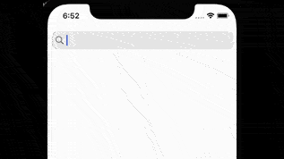
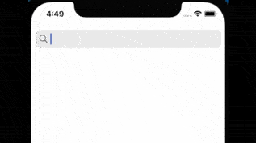
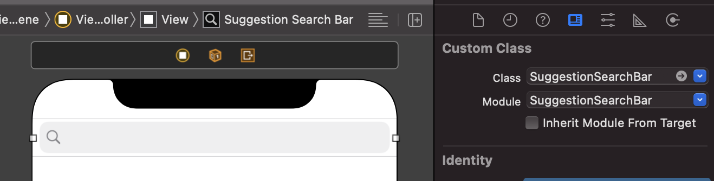

# SuggestionSearchBar

A library to add a suggestion list to your iOS Search Bar

Its based on [ModernSearchBar](https://github.com/PhilippeBoisney/ModernSearchBar), work by [Philippe Boisney](https://github.com/PhilippeBoisney).




## Install
### Swift Package Manager
Screenshots is available through [Swift Package Manager](https://github.com/apple/swift-package-manager/).

#### Xcode

Select `File > Swift Packages > Add Package Dependency...`,  

Or add this package manually to the dependencies in your `Package.swift` file:

```swift
.package(url: "https://github.com/dequin-cl/SuggestionSearchBar.git", from: "1.0.0")
```
## Usage
### 1. Configure Storyboard
After installing the library, you add a UISearchBar onto your Storyboard with class and module **SuggestionSearchBar**



### 2. Configure ViewController

```Swift
// Import the library
import SuggestionSearchBar

// Use the appropiate class for the IBOutlet
@IBOutlet var searchBar: SuggestionSearchBar!

// Set SuggestionSearchBar delegate
searchBar.delegateSuggestionSearchBar = self

// Set Data to fill the Suggestion List

// 1. Using a list of Strings

func prepareSuggestionWithStrings() {
    let list: [String] = ["Chocolate", "Sugar", "Flour", "Butter"]

    searchBar.setDatas(datas: list)
}

// 2. Using a list of SuggestionSearchBarModel

func prepareSuggestionWithSuggestionSearchBarModel() {
    var list: [SuggestionSearchBarModel] = []
    list.append(SuggestionSearchBarModel(title: "Alpha",
                                         url: "https://github.com/dequin-cl/SuggestionSearchBar/Screenshots/Alpha.png"))
    list.append(SuggestionSearchBarModel(title: "Bravo",
                                         url: "https://github.com/dequin-cl/SuggestionSearchBar/Screenshots/Bravo.png"))

    searchBar.setDatasWithUrl(datas: list)
}
```

#### Implement Delegation

You need to inform to SuggestionSearchBar the height of the Keyboard (if present) so the library can correctly determine the height of the Suggestion list.

Also, you will find some methods to respond to the actions performed by the user on the Suggestion list.


```swift
// Add SuggestionSearchBar Delegate conformation to your class
extension ViewController: SuggestionSearchBarDelegate {

    func getKeyboardHeight() -> CGFloat {
	    // 'keyboardHeight' is local variable that tracks the keyboard's
	    // height to determine the size of the Suggestions List
	    
		return keyboardHeight 
    }

    func onClickItemSuggestionsView(suggestionSearchBar: SuggestionSearchBar, item: String) {
        print("Using suggestionSearchBar: \(suggestionSearchBar)")
        print("User touched this item: "+item)
    }

    func onClickItemWithUrlSuggestionsView(suggestionSearchBar: SuggestionSearchBar, item: SuggestionSearchBarModel) {
        print("Using suggestionSearchBar: \(suggestionSearchBar)")
        print("User touched this item: "+item.title+" with this url: "+item.url.description)
    }

}

```

## Licensing information
Screenshots is under the MIT License.

## Supported platforms and versions of Swift

Swift 5.2 and up

Platforms Tested:

* iOS 12 and up.
* iPadOS.

## Contact information

* **twitter**: @dequin_cl
* **email**: dequin@hey.com
